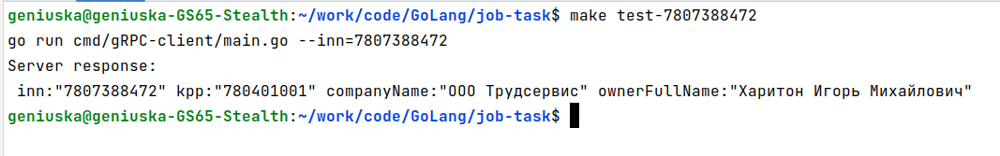
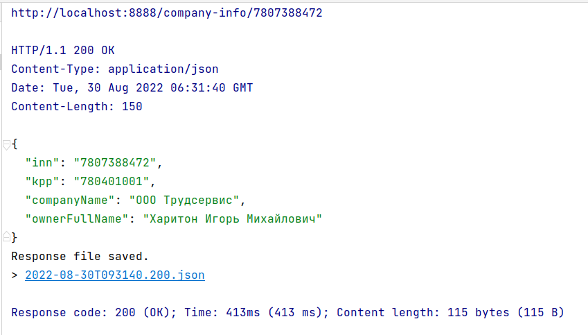

# Тестовое задание для Go разработчика в Штрафов.НЕТ 

### Запуск сервиса 

Для запуска сервиса в Docker введите в терминал команду `make run`
Если по какой-либо причине команда `make run` не работает, выполните
данные команды для запуска сервиса:
```
 docker build --tag job .
```
```
 docker run -d --name emil -p 9997:9997 -p 8888:8888 job
```

### Тестирование сервиса

1. Чтобы запустить gRPC client введите команду `make test-*`, где
   \* - это ИНН компании, данные которой мы хотим узнать.
В случае, если команда `make test-*` не работает используйте команду
   `go run cmd/gRPC-client/main.go --inn=*`, где \* - это ИНН компании.

**Пример запроса**

`make test-7807388472`




2. Чтобы протестировать gRPC-Gateway вам следует отправить
`GET` запрос по адресу `localhost:8888/company-info/*`, где вместо
\* вам нужно вставить желаемый ИНН. Для вашего удобства в корне 
проекта находится файл `requests.http` откуда вы сразу можете сделать данный
запрос.

**Пример запроса**

`localhost:8888/company-info/7807388472`



**Также вы можете скачать готовый образ данного проекта**

`docker pull geniuska/job-task:latest`